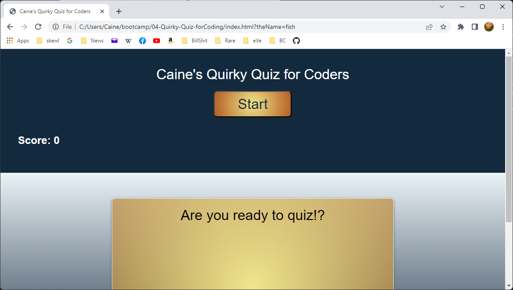

# 05-Day-Planner-Greatness :grin:
## By Caine Winters

### Screenshot of Day Planner application landing page.

## Links
### [Link to repo](https://github.com/elcaine/05-Day-Planner)
### [Link to finished product](https://elcaine.github.io/05-Day-Planner/)

### Game mechanics
- Current date displays automagically at top of page.
- Hour time-blocks, from 9am to 5pm, are crisply displayed.
    - Blocks are automagically highlighted based on current time.
        -Past: grey.
        -Current: red.
        -Future: green.
- Notes, to-do's, etc. can be typed into hour blocks and saved.
- After page refresh data persists via localStorage.

### Acknowledged sources
- Starter code given with assignment.
